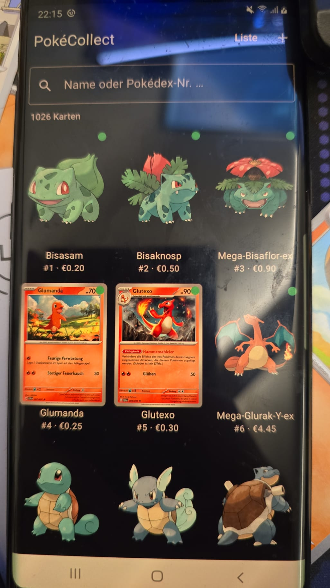

# PokéCollect

A free, self-hosted Pokémon TCG collection tracker. Track your physical cards with a Pokédex-style grid, scan new cards with your Android phone, and keep your data on your own hardware — no subscription, no cloud, no account required.

> **Current version: v0.4.1** — Actively developed. [See full roadmap →](ROADMAP.md)

---

## Screenshots

| Collection Grid | Card Detail |
|---|---|
|  |  |

| Add Card | Statistics |
|---|---|
|  |  |

**Android companion app:**



---

## Features

### Web App
- **Pokédex-style grid** — all 1025 Pokémon as placeholders, owned cards shown with real card images
- **Pokédex integrity** — adding a card automatically fills the placeholder; deleting restores it
- **70+ sets** with structured data — SV, SWSH, SM, XY, MEG generation. Searchable set picker with card number format hints
- **Official rarity symbols** — ●◆★☆✦ and PROMO star for EN/DE cards; text codes (C/U/R/RR/SR/AR...) for JP/CN
- **Automatic card images** — fetched from pokemon.com for SV-era sets
- **Photo upload** — upload your own card scans
- **Price tracking** — Cardmarket value per card
- **Statistics dashboard** — rarity/language breakdown, top 10 by value, recently added
- **DE/EN interface** — language toggle in navbar, preference saved in localStorage
- **Filters** — generation, set, rarity, language, image status, sort

### Android App *(in development)*
- Browse and edit your collection on your phone
- **Card scanner** with on-device OCR (ML Kit, CameraX) — currently tested with German cards
- Connects to the same PostgreSQL database as the web app
- Offline cache via Room

---

## Quick Start

```bash
git clone https://github.com/Trust1509/pokecollect.git
cd pokecollect
cp .env.example .env
# Edit .env — set POSTGRES_PASSWORD, JWT_SECRET, NEXT_PUBLIC_API_URL
docker compose up --build
```

- **Web frontend:** `http://localhost:3011`
- **API + Swagger UI:** `http://localhost:3010/docs`

---

## Configuration

| Variable | Required | Description |
|----------|----------|-------------|
| `POSTGRES_PASSWORD` | ✅ | Database password |
| `JWT_SECRET` | ✅ | Random string for JWT signing (min. 32 chars) |
| `NEXT_PUBLIC_API_URL` | ✅ | URL the browser uses to reach the API (e.g. `http://192.168.x.x:3010`) |
| `CARDMARKET_APP_TOKEN` | ➖ | Cardmarket OAuth 1.0a — register at api.cardmarket.com |
| `CARDMARKET_APP_SECRET` | ➖ | Cardmarket OAuth 1.0a |
| `CARDMARKET_ACCESS_TOKEN` | ➖ | Cardmarket OAuth 1.0a |
| `CARDMARKET_ACCESS_SECRET` | ➖ | Cardmarket OAuth 1.0a |
| `POKEMONTCG_API_KEY` | ➖ | Free key from pokemontcg.io |

---

## Server Deployment (TrueNAS / Portainer)

See [deploy/README.md](deploy/README.md) for step-by-step instructions including ZFS POSIX-ACL dataset setup, Portainer stack deployment, and Caddy reverse proxy config.

---

## Tech Stack

| Layer | Technology |
|-------|-----------|
| Backend | Python 3.12, FastAPI, SQLAlchemy, PostgreSQL 16 |
| Frontend | Next.js 14, React 18, TypeScript, Tailwind CSS |
| Android | Kotlin, Jetpack Compose, ML Kit OCR, CameraX, Room, Hilt |
| Deployment | Docker Compose, Portainer, Caddy |

---

## Roadmap

See [ROADMAP.md](ROADMAP.md) for the full roadmap. Coming up:
- Binder view (page-by-page like a physical binder)
- Cardmarket price integration
- Wishlist
- PokémonTCG.io for SWSH/XY card images
- External access via Authelia

---

## License

MIT
