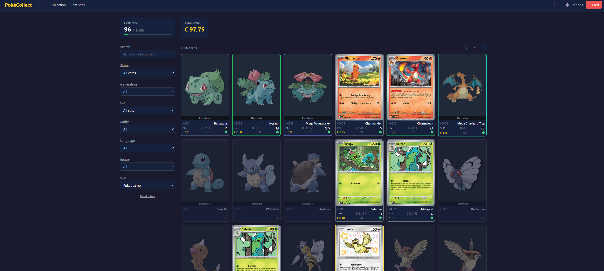
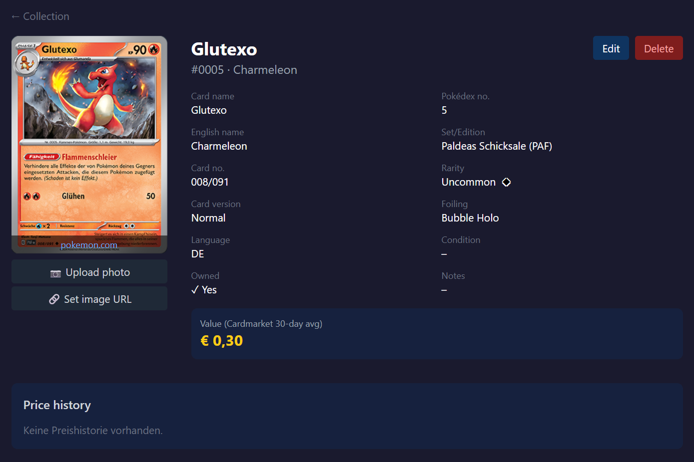
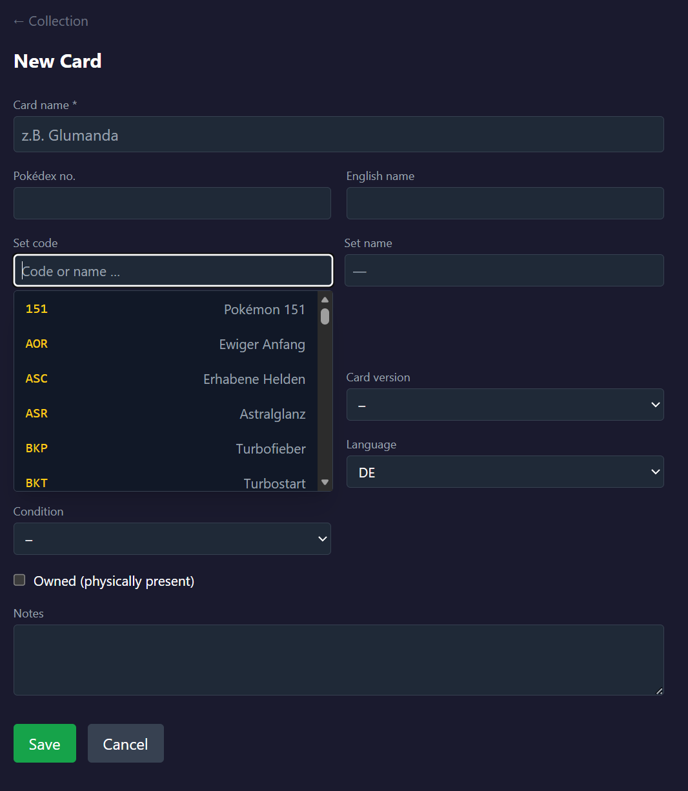
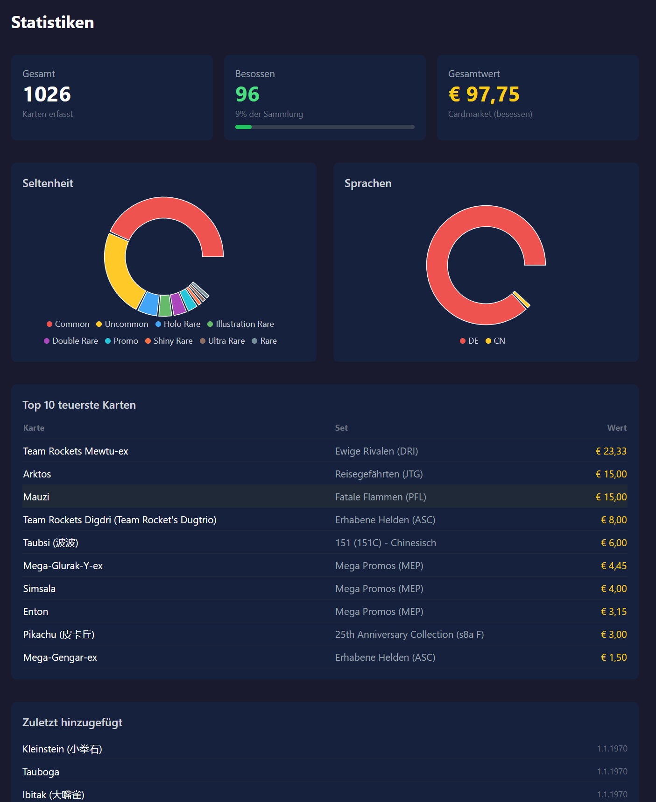

# PokéCollect

A free, self-hosted Pokémon TCG collection tracker. Track your physical cards in a Pokédex-style grid or page-flip binder, scan new cards with your phone camera (Gemini Vision or local OCR), browse the full TCGdex catalog, and keep all data on your own hardware — no subscription, no cloud, no third-party account required.

> **Current version: v0.9.11** — Actively developed. [Roadmap →](ROADMAP.md) · [Changelog →](CHANGELOG.md)

---

## Screenshots

| Collection Grid | Card Detail |
|---|---|
|  |  |

| Add Card | Statistics |
|---|---|
|  |  |


## Features

### Collection
- **Pokédex view** — all 1025 Pokémon as a grid or binder; owned cards fill their slot, missing ones show the official artwork placeholder. One representative card per species ("Im Pokédex" flag).
- **Binder view** — configurable page layout (1×1 … 4×4), drag & drop between slots, page management, swipe to flip pages on mobile. Filters dim non-matching cards instead of removing them, so every card keeps its place.
- **Free collections** — any number of custom binders/collections (n:m), each with its own layout and slot order.
- **Wishlist** with priorities (Chase/Hoch/Mittel/Niedrig).
- **Catalog** — local mirror of the full TCGdex card database (~23,000 cards), searchable by name/number/illustrator, filterable by set/generation; one click adds a card to the wishlist or a collection.

### Card scanning
- **Hybrid engine:** Google Gemini Vision (if an API key is set — manageable from the settings page) with local Tesseract OCR as fallback.
- **Three modes:** single card, multiple loose cards, full binder page (grid).
- **Server-side resolver** matches every read against TCGdex (set + printed number, name fallback) and pre-fills the review dialog with confidence scores and uncertain-field highlighting.
- **Photo pipeline:** EXIF normalization, perspective de-skew via homography, manual 4-corner editor with magnifier/zoom/pan, rotate/flip, original photo kept for later re-cropping.
- **Gemini usage tracking** (requests/tokens per day) with free-tier limit display.

### Data & prices
- **TCGdex as the single data source** — card data, images (`high.webp`) and Cardmarket EUR prices, free and without an API key. Cardmarket OAuth remains an optional fallback.
- **Daily cron jobs** — price refresh (hour configurable in settings) and catalog sync/enrichment.
- **Price history** per card with chart.

### UI
- **Mobile-first + PWA** — bottom navigation, installable, offline read access via service worker (HTTPS required for install/camera).
- **DE/EN interface** — language toggle in the navbar; card names switch with the language.
- **Official rarity symbols** (●◆★ …, PROMO star) for western cards, text codes (C/U/R/RR/SR/AR …) for JP/CN.
- **Consistent filters** across Pokédex, owned cards and catalog: search, status, generation, set (grouped by series, with logos), rarity, language, illustrator, image status, sort.
- **Statistics dashboard** — rarity/language breakdown, top 10 by value, recently added.

---

## Architecture

```
web (Next.js 14, Port 3011)  ──►  api (FastAPI, Port 3010)  ──►  PostgreSQL 16
        │                              │
        │   direct                ├──►  TCGdex API (cards, images, prices)
        └──────────────────────────────┴──►  Gemini API (optional, card scan)
```

Card images load directly from `assets.tcgdex.net` in the browser; own photos are served from the API's `/images` static mount.

- **Backend** `backend/` — FastAPI + SQLAlchemy. Schema is created automatically on startup (`create_all` + idempotent light migrations in `app/main.py`); no Alembic.
- **Frontend** `web/` — Next.js 14 App Router, Tailwind CSS, Axios. `NEXT_PUBLIC_API_URL` is baked in at **build time**.
- **Auth note:** the API currently runs without enforced auth and is intended for trusted LAN use; external access is protected via Authelia + Caddy (see [deploy/README.md](deploy/README.md)). Full in-app auth is planned for v1.0.

---

## Quick Start

```bash
git clone https://github.com/Trust1509/pokecollect.git
cd pokecollect
cp .env.example .env
# Edit .env — set POSTGRES_PASSWORD, JWT_SECRET, NEXT_PUBLIC_API_URL
docker compose up --build
```

- **Web frontend:** `http://localhost:3011`
- **API + Swagger UI:** `http://localhost:3010/docs`
- **Health/version:** `http://localhost:3010/health`

---

## Configuration

| Variable | Required | Description |
|----------|----------|-------------|
| `POSTGRES_PASSWORD` | ✅ | Database password |
| `JWT_SECRET` | ✅ | Random string for JWT signing (min. 32 chars) |
| `NEXT_PUBLIC_API_URL` | ✅ | URL the **browser** uses to reach the API (e.g. `http://192.168.x.x:3010`). Build-time variable — rebuild the web image after changing it. |
| `CORS_ORIGINS` | ➖ | Comma-separated list of allowed browser origins (e.g. `http://192.168.x.x:3011`). Empty/unset = defaults `http://localhost:3011,http://localhost:3021`. |
| `APP_USERNAME` / `APP_PASSWORD_HASH` | ➖ | Single-user login credentials (bcrypt hash) |
| `GEMINI_API_KEY` | ➖ | Enables the strong Gemini scan engine; also manageable in the settings UI |
| `CARDMARKET_*` | ➖ | Cardmarket OAuth 1.0a — optional price fallback only |
| `POKEMONTCG_API_KEY` | ➖ | Legacy, no longer needed |

TCGdex needs **no key**. Redis is no longer part of the stack (removed in v0.9.11).

---

## Server Deployment (TrueNAS / Portainer)

See [deploy/README.md](deploy/README.md) for step-by-step instructions: ZFS POSIX-ACL datasets, Portainer stack, Caddy reverse proxy and external access via Authelia.

Updates: `bash deploy.sh` (git pull → rebuild api+web → restart).

| Service | Host port |
|---------|-----------|
| API | 3010 |
| Web | 3011 |
| Authelia (optional) | 9091 |

---

## Tech Stack

| Layer | Technology |
|-------|-----------|
| Backend | Python 3.12, FastAPI, SQLAlchemy 2, PostgreSQL 16, APScheduler |
| Frontend | Next.js 14, React 18, TypeScript, Tailwind CSS, PWA |
| Scan | Google Gemini (REST) / Tesseract OCR, Pillow, Canvas-Homographie |
| Data | TCGdex API (cards, images, Cardmarket prices) |
| Deployment | Docker Compose, Portainer, Caddy, Authelia |

---

## License

MIT
